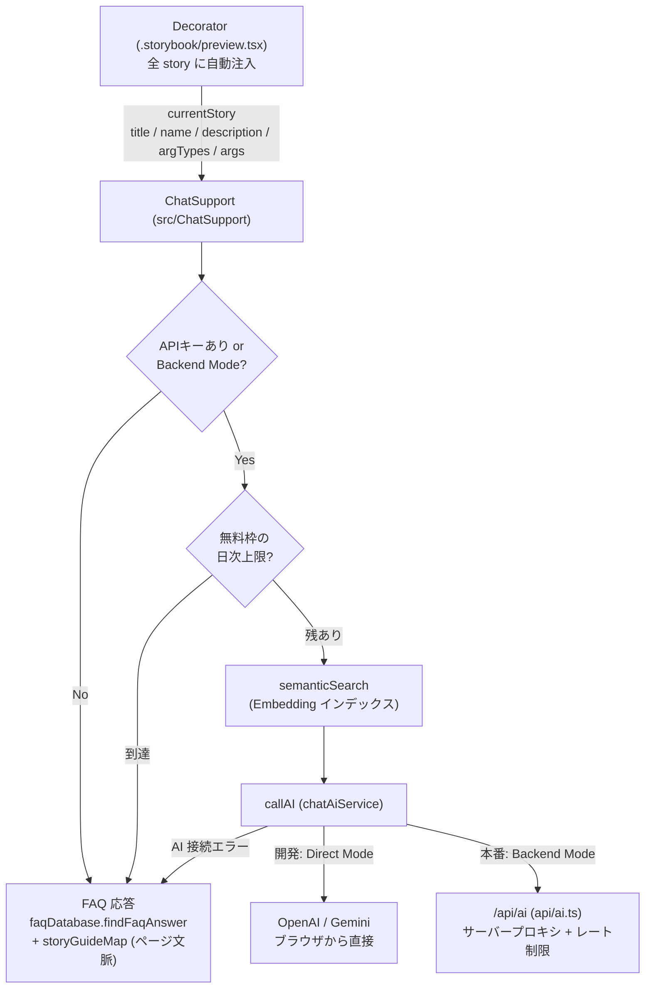

# storybook-concierge

> **TL;DR (English):** A reference implementation of "Concierge" — an AI chat widget that lives on every Storybook story and answers questions about the component currently on screen. Works out of the box with a built-in FAQ (no API key required); plug in an OpenAI / Gemini key for free-form AI answers. Ships with a backend-proxy design so shared builds never contain credentials. MIT licensed.

Storybook の全 story に常駐する AI チャット「Concierge」のリファレンス実装です。
画面右下の FAB からチャットを開くと、**いま表示している story の文脈**（title / name / description / argTypes / args）を踏まえて質問に答えます。

- **API キー無しでも動く**: 内蔵 FAQ + ページガイド（storyGuideMap）で応答
- キーを入れると AI（OpenAI / Gemini, AI SDK v6）+ Embedding によるセマンティック検索で自由質問に対応
- 公開デプロイ前提の設計: **共有キーをバンドルに焼き込まない**（本番ビルドで機械的に除去 + バックエンドプロキシ + レート制限）

## デモの動かし方

```bash
pnpm install
pnpm storybook   # http://localhost:6206
```

これだけで動きます。**API キーは不要**です。キーが無い場合、Concierge は内蔵 FAQ とページガイドで応答します（「この画面は何？」のようなページ文脈の質問にも答えます）。

## 他プロジェクトへの導入

`src/ChatSupport/` は**自己完結している**（ディレクトリ外への import が無い）。
コピーして Decorator を配線すれば、**知識ベースを 1 行も書かなくても
そのプロジェクトのページについて答える**。

Storybook が既に持っているメタ情報（story の title / name /
`parameters.docs.description.component` / 現在の args）を Decorator が実行時に渡すため。

```
storyGuideMap 登録ゼロの状態で「この画面なに？」と聞いた実際の応答:

  Controls パネルで variant / color / size を変更して、見た目の変化を…
  - variant — text（最も控えめ）/ outlined（枠線）/ contained（塗りつぶし）
  …
  このページで触れる props: variant, color, size, disabled, children
```

より深い回答が要るページは、Storybook から下書きを生成して足す。

```bash
pnpm build-storybook
pnpm generate:story-guide > src/ChatSupport/storyGuideMap.generated.ts
```

FAQ は `CHAT_FAQ`（チャット操作・Storybook 一般。そのまま使える）と
`PROJECT_FAQ`（このデモ固有。差し替える）に分かれている。

手順の全体と検証ゲートは `skills/add-storybook-concierge/SKILL.md` にある。
Claude Code なら、このスキルを `~/.claude/skills/` か対象プロジェクトの
`.claude/skills/` に置けばそのまま実行できる。

## API キーを使う場合

自由質問に AI で答えさせたい場合は、`.env.example` を `.env` にコピーしてキーを設定します。

```bash
cp .env.example .env
# VITE_OPENAI_API_KEY=... を設定
pnpm storybook
```

各項目の説明は [.env.example](./.env.example) を参照してください。

### 共有キーを配らない設計

このリポジトリは「チームに共有キーを配って各自の `.env` に貼る」運用を意図的に避けています。

| モード               | キーの置き場所                                               | 用途             |
| -------------------- | ------------------------------------------------------------ | ---------------- |
| Direct Mode（開発）  | `.env` の `VITE_OPENAI_API_KEY`（ブラウザから直接呼ぶ）      | ローカル開発のみ |
| Backend Mode（本番） | サーバー環境変数（`OPENAI_API_KEY` 等、`VITE_` prefix なし） | 公開デプロイ     |

- `build-storybook`（本番ビルド）では、`.storybook/main.cjs` が **資格情報の define をビルド種別で機械的に空文字にする**ため、`.env` にキーが残っていても共有ビルドには焼き込まれません
- 本番は同一オリジンの `/api/ai`（[api/ai.ts](./api/ai.ts)、Vercel Function）を経由します。キーはサーバー側にだけ存在し、`lib/ratelimit.ts` が IP ごとの日次上限を適用します
- 利用者が自前キーを持つ場合は `X-User-API-Key` ヘッダーで送り、レート制限を免除できます
- Origin 許可リストは硬い天井にはならないため、**請求の上限はプロバイダ側の予算設定**で設けてください

## アーキテクチャ



- Decorator は `viewMode !== 'docs'` のときだけ注入します（Docs ページは 1 ページに複数 story が並び、文脈が一意でないため。FAB の重複防止も兼ねる）
- `parameters.disableDecoratorChat: true` で story 単位のオプトアウトができます（ChatSupport 自身のデモ story で使用）
- AI 呼び出しに失敗した場合も FAQ にフォールバックし、「送っても何も起きない」状態を作りません

## ディレクトリ構成

```
storybook-concierge/
├── .storybook/
│   ├── main.cjs             # Storybook 設定（esnext / destructuring 対策、本番でのキー除去）
│   └── preview.tsx          # Decorator（全 story への Concierge 注入）
├── src/
│   ├── ChatSupport/         # Concierge 本体（FAB + チャット UI + AI/FAQ ロジック）
│   ├── stories/             # デモ用 story
│   └── theme/               # MUI テーマ / モーショントークン
├── lib/
│   ├── maxOutputTokens.ts   # モデル別 maxOutputTokens の単一ソース（ブラウザ/サーバー共用）
│   ├── cors.ts              # Origin 許可リスト
│   └── ratelimit.ts         # 日次レート制限（Upstash Redis / in-memory）
├── api/
│   └── ai.ts                # バックエンドプロキシ（Vercel Function）
├── skills/
│   └── add-storybook-concierge/
│       └── SKILL.md         # 既存 Storybook への組み込み手順（Claude Code 用）
└── .env.example             # 環境変数の説明
```

## 既存の Storybook に組み込む

Claude Code が実行できる再現手順を [skills/add-storybook-concierge/SKILL.md](./skills/add-storybook-concierge/SKILL.md) に置いています。手で組み込む場合も、同ファイルの手順と検証ゲートをそのまま使えます。

## 解説記事

解説記事: 準備中

## License

MIT © 2026 [BoxPistols](https://github.com/BoxPistols)
